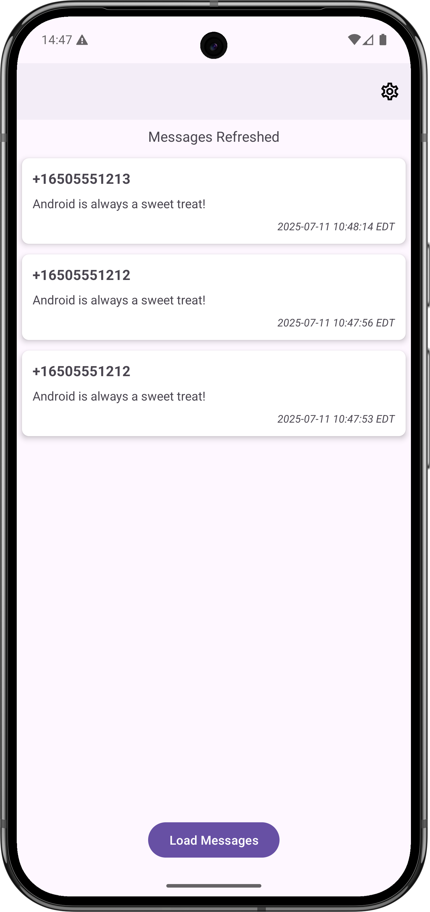
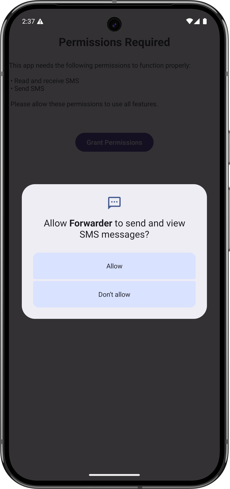
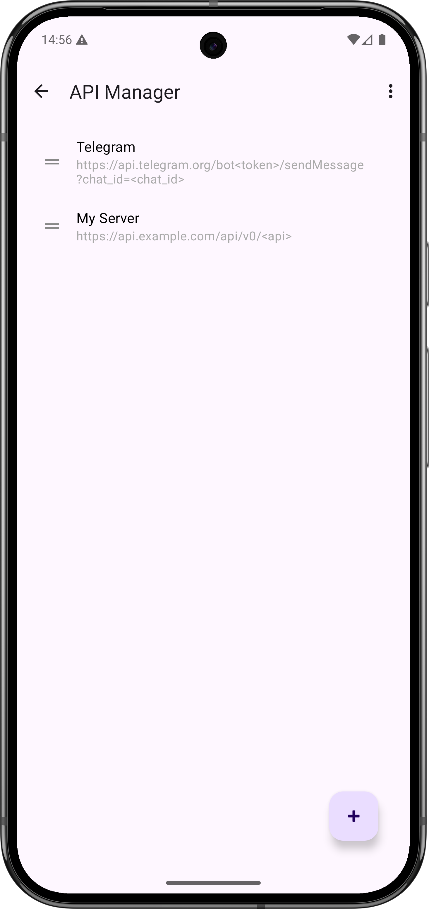
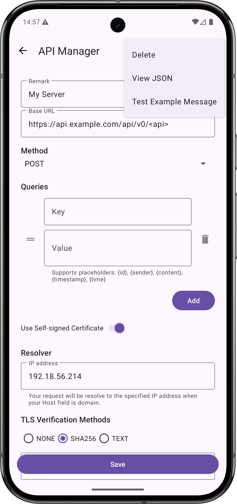
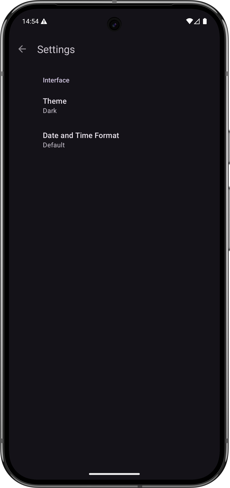

# SMS Forwarder

SMS Forwarder is an Android application designed to provide message forwarding to your specific API.

## Features

- Message forwarding between apps or services
- Permission management for enhanced security
- Dashboard for monitoring and control
- Settings panel for customization

## Project Structure

- `app/` - Main application module containing source code and resources
- `images/` - Screenshots and image assets
- `build.gradle.kts`, `settings.gradle.kts` - Gradle build scripts

## Screenshots

  
  

  
  

  

## Getting Started

1. Clone the repository and open it in Android Studio.
2. Ensure your local environment is set up (e.g., configure `local.properties` for SDK path).
3. Connect an Android device or start an emulator.
4. Build and run the app from Android Studio.

## License

This project is licensed under the MIT License.

